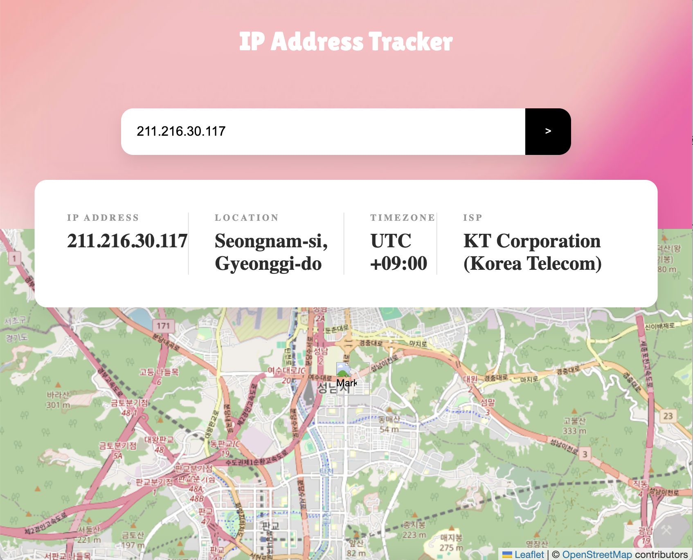

# 🗺️ IP Address Tracker

A responsive IP Address Tracker built with React, TypeScript, and Vite. This application allows users to search for any IP address or domain and see its location on an interactive map. This Project was fun to build and working with the different APIs really challenged me. I also loved implementing the Info Display CSS. I think the overlap over the navbar and map components adds a nice  touch.I have never used Netlify for deployment before so this was a fun learning activity. 

## 🚀 Live Demo
[View the Live Site Here](https://lighthearted-griffin-77664d.netlify.app/)

## ✨ Features
- **IP/Domain Search:** Look up details for any public IP or domain.
- **Interactive Map:** Visualizes the location using Leaflet.js with a custom marker.
- **Automatic Detection:** Shows the user's own IP address on initial load.
- **Fully Responsive:** Optimized for mobile, tablet, and desktop screens.

## ✨ Project Highlights
**Dynamic Search:** Seamlessly track any IPv4/IPv6 address or domain.

**Interactive Mapping:** Utilizes Leaflet.js to provide a real-time, draggable map with custom markers.

**Complex UI Layout:** Features a sophisticated CSS "overlap" design where the info panel bridges the gap between the header and the map.

**Modern Stack:** Built with React, TypeScript, and Vite for a fast, type-safe developer experience.

## 🧠 Lessons Learned
This project was a significant milestone in my development journey. Here is what I tackled:

**API Orchestration:** Handling asynchronous data fetching from the IP Geolocation API while managing loading states and error handling.

**Advanced CSS Layouts:** I took a deep dive into CSS positioning to create the Info Display component. Getting that "floating" overlap effect between the Navbar and the Map was a rewarding challenge in layout math and z-indexing.

**Cloud Deployment:** This was my first time using Netlify! I learned how to configure build settings for nested directories and how to securely manage Environment Variables for API keys in a production environment.

**How I Handled the API Key:**
**Environment Variables:** I utilized .env files to store sensitive credentials locally, ensuring they are never hard-coded into the components.

**Git Security:** I configured .gitignore to prevent the environment files from being pushed to the public repository.

**Production Safety:** For the live deployment, I used Netlify’s Environment Variables dashboard to securely inject the key into the build process. This prevents the "API key leaked" warnings that often happen in public projects.

## 🛠️ Built With
- [React](https://reactjs.org/) - Frontend library
- [Vite](https://vitejs.dev/) - Build tool
- [TypeScript](https://www.typescriptlang.org/) - Type safety
- [Leaflet.js](https://leafletjs.com/) - Interactive maps
- [IP Geolocation API by IPify](https://geo.ipify.org/) - IP data

## 📸 Preview
 

## ⚙️ Local Setup
1. Clone the repo: `git clone <your-repo-link>`
2. Install dependencies: `npm install`
3. Create a `.env` file and add: `VITE_IPIFY_API_KEY=your_key_here`
4. Run the app: `npm run dev`
